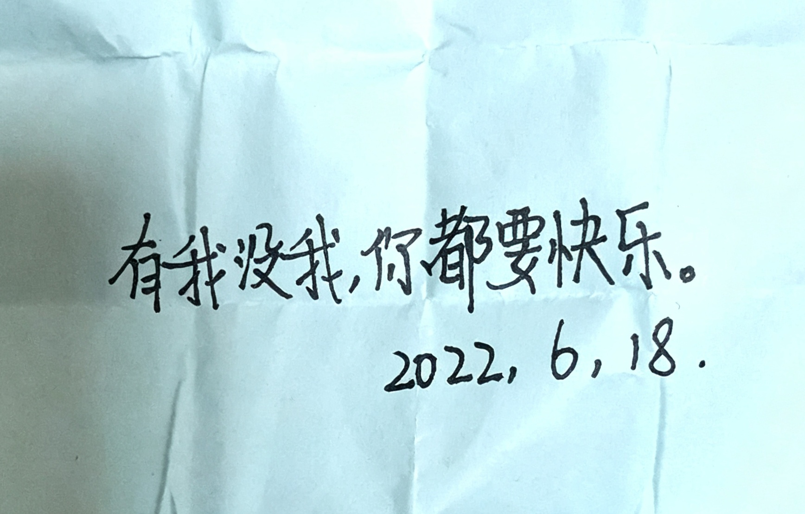

# 第11章 象棋

> "有我没我，你都要快乐。"
>
> ——她的短笺，2022年6月18日

---

2022年高考假，我突发奇想：去怡蓉镇找她。

这个念头是怎么冒出来的，我已经记不清了。大概是某个晚上，躺在床上，忽然想到——假期这么长，我为什么不去看看她呢？想到这个念头的一瞬间，我自己都吓了一跳。去怡蓉镇，坐车要一个多小时，那个镇子我从来没去过，路也不认识。可那个念头一旦冒出来，就再也压不下去了，像一粒种子，在夜里悄悄地发了芽。

我先在QQ上试探，说虽然有点不切实际，但是我想放假的时候去找她。她说，那就她来找我。我说不用了，我去。

于是她开始给我规划路线：在哪里下车、坐哪班车、在哪里买票，一条一条说清楚，怕我找不到，连司机的电话都发给了我："自己问叔叔中午几点有车，不要傻等着。"

我一条一条地看，像看一张藏宝图。我盯着那些字，忽然觉得，这个假期，从这一刻起，就有了盼头。

出发前一天，我先坐车去了一趟宋安那边的镇子——那是我第一次坐车去乡镇。那天下午，我还去车站看了一眼，人太多了，真就只看了一眼。回到家的晚上，我把她发来的路线在脑子里又过了一遍，心里想的却全是明天的事。

---

出发那天，我上了车，一路上都在想一个恶作剧。

我在心里排练了好几遍，想象她看到消息时的表情。车子晃晃悠悠地开着，窗外的稻田一片一片地过去。我握着手机，手心有点出汗。

到了以后，我先发："我下午来不了了。"

过了快一分钟，她回："好的呢。"她没急，一个字都没多问。

我在屏幕这头等了一会儿，只好自己揭穿："因为其实我已经到了。"

她发来两个问号，说从家到商场至少得二十分钟车程。我说没事，我又不去她家。她说我就是傻。

恶作剧没吓到她。倒是后来，我自己真的迷路了。镇上的路到处在修，我越走越偏，走到后来，连自己在哪都说不清。她发消息来问我在哪，让我别乱走。我说我也不知道，让她先吃完饭再找我。她说她到了，让我拍张附近的照片给她看。我回她稍等，在往回走。她又问我认不认路。我说不认路，反正我就是直走。

最后她找到我的时候，我站在路边，手里拎着一本书。

《傲慢与偏见》。去翰林书屋的时候顺便买的，她喜欢这本，我知道。我就带着它来见她。像带着一封不会说话的信。

---

那天她带我逛怡蓉镇。她请我喝奶茶，带我把镇子转了个遍。路过小卖部，她当场买了一副象棋，说要跟我下。我问她会不会，她说不会，但可以学。

我们坐在一个阴凉的角落下象棋。她连规则都不熟，走一步问一步。我让着她，她还不高兴，非要按自己的来。

那盘棋没下完。

天快黑的时候，我才想起来，我们俩一整天都没吃正餐。中午没吃，晚饭也没吃，光顾着走了。

今天让她为我买单太多了，我想要转账给她，让她去吃饭，她不肯收。我说："把钱收了，不然我不吃了。"她这才收了。

---

就这样，我们加了微信。之前两年，我们的所有联系都在QQ上，从那天起，换到了微信。

晚上我到家，给她报平安。

我说："活着回到家了。"

她说我说话难听。可我是认真的。一个社恐的人，独自坐车去一个陌生的镇子，找自己喜欢的女生，能活着回到家，已经很了不起了。我坐在回家的车上，看着窗外的夜色，回想这一天：迷路，象棋，还有她找到我时，脸上那又急又气的表情。这一天像一场梦，可它是真的。

三天后的凌晨一点十九分，我写了一封信，存在QQ邮箱里。

信里写：

> 亲爱的梨晚:
>
> 话说语言真是充满魅力，仅仅是把称呼中的"同学"二字去掉，就能表现出人与人关系的变化了。
>
> 这次写信可以算是一次试验，也算是一个思春期的发泄的地方吧，所以可能会出现一些奇奇怪怪的东西，还请见谅。
>
> 第一次以这种方式和你对话，会感到一丝的微妙。不同于见面会太过紧张，也不同于QQ聊天会反复斟酌每一句话，直接写信的话确确实实就是想到啥写啥，同时这样双方会有一定的"滞后"（大概就是不能实时了解到信息），就变得更期待对方的回信了。这大概就是为什么写信时会感到愉悦吧。
>
> 其实说到写信，当初二月份的时候也有在开始写，那时还没回子衿，也没跟你表白，就是有一种很暧昧的关系，但是又说不出口，也产生了"她好像喜欢我"和"我好像喜欢她"的感觉，于是自己闲来无事的时候也在写，还打算高考后一口气丢给你的，结果没想到事情发展得如此魔幻，我俩只不过见了几天面就表露情感了，果然还是乳臭未干了。
>
> 其实我很担忧，你会不会有一天就不喜欢我了。每天都在担忧这件事，特别是那次高考假去怡蓉找你的时候，我只能表现出无能和软弱，啥也干不了。但是你愿意陪我玩，给我买奶茶，带我逛怡蓉，陪我下你可能不爱玩的象棋。看着你的样子，除了对你的喜欢，还有心酸。我很感谢有人愿意这样和我在一起，但是我又好心疼你做了那么多的事，为自己感到惭愧。
>
> 今天就写这么多吧，以后想到啥也会记下来的。真切地希望你能过得开心。

凌晨一点十九分，家里的人都睡了，只有手机屏幕亮着。我一个字一个字地打，打打停停。那句话在白天是说不出口的，只有深夜里，对着屏幕，才敢写下来。写完之后，我看了很久，没有发出去，一直躺在笔记软件里。

九天之后，她的短笺到了我手上。全文只有一句：

"有我没我，你都要快乐。"

