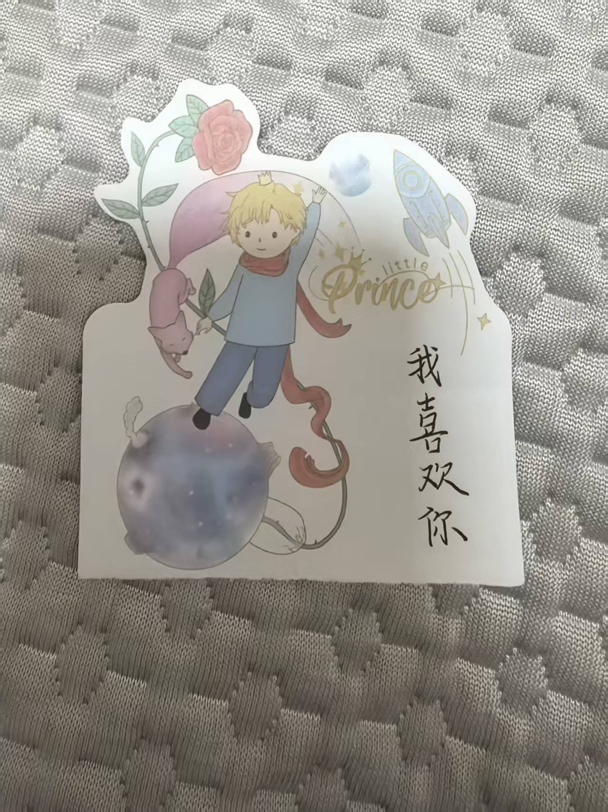
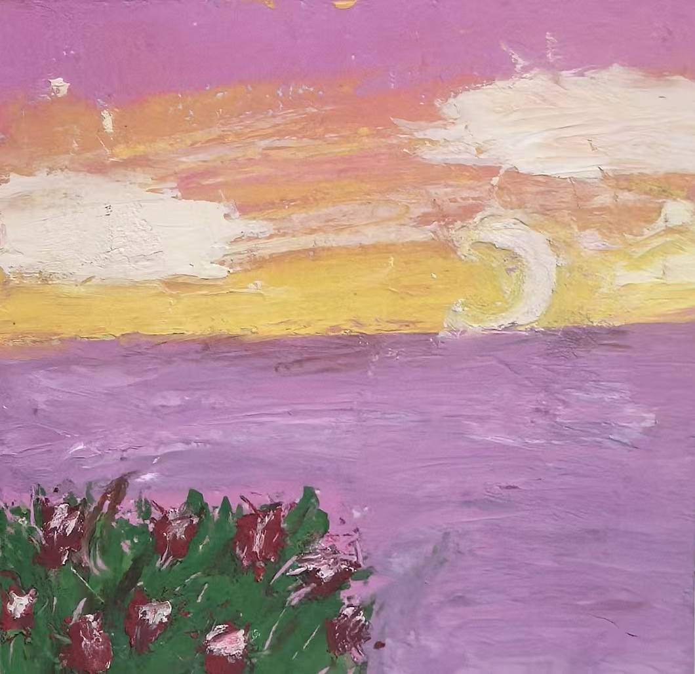

# 第14章 一起去看海吧

> "予君承诺：吾将奋发向上，与君偕行。"
>
> ——她的卡片，2022年10月30日

10月30号早上，她问我，你现在在家吗。我说刚起床。

她说："我想见你。"

我说，虽然我也想，但估计做不到。她问我几点走，我说十一点。

"我已经上车了。"她说，"八点九的车。"

八点九的车。她问我的时候，人已经在路上了。

我盯着那句"我已经上车了。"，愣了好几秒。她不是问我要不要见，她是已经在来的路上了——先斩后奏，人上车了才告诉我。我回得慢了，她连催了两句。我说刚做完核酸，你要真想的话，我尽量。

她说，好好好。我说我家离东站挺近的。她说，我到子衿给你发消息。

---

十点零四分，她的消息到了：我到了。

我说好，这就来。东站附近，我还在张望，手机又响了：

"我在你后面。"

我回头。她站在几步外。

她站在几步外，秋天的阳光落在她身上。书包背带勒着肩膀，鼓鼓囊囊的，不知道塞了多少东西。她看着我，没说话，笑了一下。我也没说话。我那时想，一个人要装多少东西，才敢说"我想见你"四个字，然后真的坐上早班车，跑几十公里来见你。

那天她递给我一堆东西。

先是一个白色信封，封口贴着一张奶茶杯的贴纸，右下角写着日期。里面是一张卡片，写着一大段话：

自古文人雅士以文字抒情，不妨我提笔为你写下心中所感。

每天都有很多话想对你说。想跟你分享今天的落日很美，想跟你吐槽一大堆写不完的作业，想跟你倾诉今天受到的委屈，想向你抱怨某人如何过分，想告诉你我今天超级开心，想跟你传纸条写下喜欢的三两句话，想跟你说：我很喜欢你。鸿雁长飞光不渡，鱼龙潜跃水成文。我的声音带不到你的耳边，只能寄情于月亮，因为相隔两地，我们望的是同一轮月亮。

总说下雨寄思情，可你总不够浪漫。雨点淅淅沥沥地落在大地上，以滋润万物，落在离人心上，添一份思愁。下次买个漂流瓶吧，将思念装进去，随着流水到你身边，可秋湘江的尽头又是哪里呢？我不知道。

如果你觉得今天的风很温柔，那你就在心里张开双臂吧，风会替我拥抱你，带走你的忧愁。

予君承诺：吾将奋发向上，与君偕行。

我读完了，回了她一句很欠揍的话：

"是鸿雁长飞光不度哦，不是鸿雁长飞光不渡。"

她愣了一下，说谢谢，不然考试就写错了。

---

然后是积木。一个宇航员造型的积木笔筒，拼好的，带灯。旁边压着一张便签：

"积木轻拿轻放！它太脆弱了，它本来吊着颗星星的，但不好拿，就不吊了。手绳是我看着教程编的，为什么这么丑我也不知道哪一步出了问题。那张小图太耗时间了，我不想重新来了，你将就着看吧。"

书包里还有一根手绳，红色的，她自己编的。还有一张画，画的是海，日落，紫色的天，一弯月亮，红色的花。画的上方写着"To 马克"，下方一行小字：

"一起去看海吧！"

再旁边，还有一张卡片。《小王子》的插画，金发的小王子站在星球上，手里握着一枝玫瑰。卡片的右侧，竖着写了四个字：

"我喜欢你。"

---

那天我们待了一会儿，我送她上了车。

回到家，我把积木摆在书桌上，手绳收进抽屉，画贴在墙上，卡片夹进书里。

那张写着"我喜欢你。"的卡片，我看了很久。

我们明明已经在一起半年了，她还在说喜欢我。用的是最贵的方式：亲手。

半年了。她送我礼物，送我卡片，在卡片上写"予君承诺"，在便签上写"我喜欢你。"她把自己能拿出来的东西，一样一样地拿出来，塞进那个鼓鼓的书包里，坐早班车来给我。而我呢？

而我回她的，是纠错别字。

