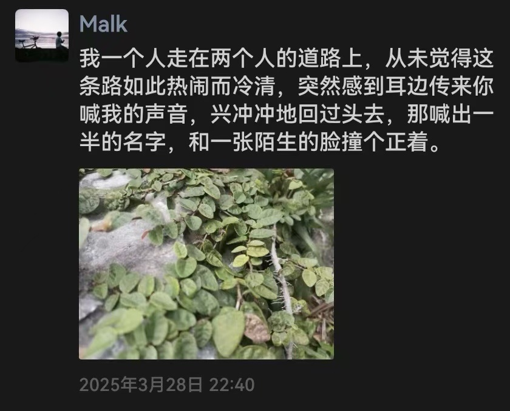

# 第39章 红色感叹号

> "你们只是交流得太少了。"
>
> ——宗知琳的话，2024年毕业典礼

考完的第二天，学校办了毕业典礼。我回了趟凤华。

典礼散场以后，礼堂里的人陆陆续续走了。我和宗知琳在教室里坐了很久。窗外的蝉叫得很响，风扇在头顶转着，我们有一句没一句地聊。她问起我们俩的事，我一五一十说了。

宗知琳听完，说了一句："你们只是交流得太少了。"

宗知琳说，回子衿的时候，希望我和梨晚拍一张拍立得。

宗知琳说这话的时候，语气很轻，像在说一件很简单的事：回子衿的时候，拍一张照片吧。好像我们还有"回子衿的时候"。我一直没拍。后来也没有机会了。

---

分手那晚，我把消息告诉了宗知琳。

我说，我要跟你说吗，我们俩已经分了。她问，啥时候啊。我说，或者说，从来没有开始吧。刚刚。

宗知琳说，她就作为一个局外人，客观地说。她也知道我们两个，两个人都跟她说过一些东西。

然后她转述了一句话。她说，梨晚其实希望我跟她说话，只是我从来没有告诉过她我的感受。

我盯着这句话，半天没回。

原来她一直在等。等我跟她说话，等我把感受告诉她。我可以说给很多人听，可以告诉宗知琳，可以告诉所有人，唯独没有告诉过她。我把所有的心里话都写在纸上，压进抽屉里，却从没有，当面对她说一句。

我说，只是我们不相配而已。她没问题，我也觉得自己没有问题。她肯定可以找到更好的。

那天晚上，我又说了很多丧气话。说大家都挺喜欢我的，那估计最讨厌我的人，就是我自己了。说我觉得我这种人活着对世界没有什么意义。说我一直都是如此，从初一开始吧。只是觉得今天少了一位让我活着有意义的人而已。但我肯定还是不会想不开的，起码我还有爸爸妈妈。

那些话，我说得又快又乱，像攒了很多年，终于找到一个出口。宗知琳没有打断我，等我说完，才开口。

宗知琳说，她觉得我整天沉浸在这些负面情绪里不太好。她说，你真的很好，你清楚吗，大家为什么喜欢你，你清楚吗。

我说，我找不到高兴的东西。

---

九月，我进了大学。课是新的，人是新的，只有手机里那些旧消息是旧的。

日子过得很不适应。分手之后的日子，更不适应。

有时候我走在大街上，看见一个背影很像她的人，心会突然揪一下。走近了，不是她，又松一口气。

又松一口气，又有点失望。

